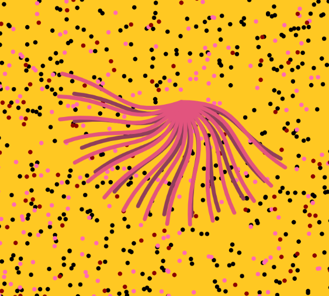

# zilu0433_9103_tut02_Group F_major-project
zilu0433_9103_tut02_major project

# **About this code**

### **Interaction**

See this grass on your screen? you can make more copy of this by dragging the root. whenever you drag this it will left a copy on the screen, it means you can create your own version of Emily Kame Kngwarreye's Grass.

### **Where this idae come from**

This is how it looks like at the very beginning, and i choose to do a mouse interaction with this. The very first idea is after I click some where and the grass will Spin, but i quickly gave up because i have no idea how to do it, it's too much. So, i try to delect all others and only keep one to edit. My other group member were doing perlin noise and audio so i wanna make somethings that user can control, and thats my final idea let the user make their own drawing. Okey, actually it just allow the user chang the position and the number of grasses.

### **How it works**

The setup function sets up the canvas and generates the initial grass, then uses two generateGrass functions to create a gras consisting of multiple curves, and then uses the combineGrasses function to merge the two grass into one.

The mouse interaction part is to use the mousePressed function to detect whether the grass is clicked, create a copy after clicked, and select the new copy to drag, and then use the mouseReleased function to deselect the grass when the mouse is released to ensure that a new copy of the grass is generated each time it is dragged.

### **some example dragging**
